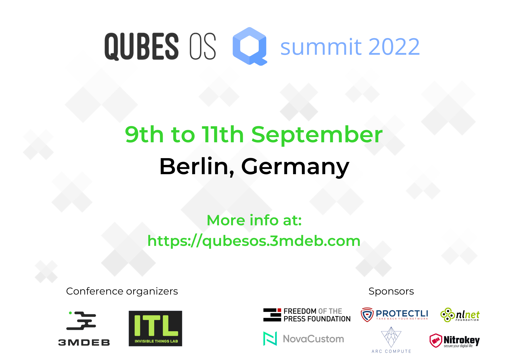
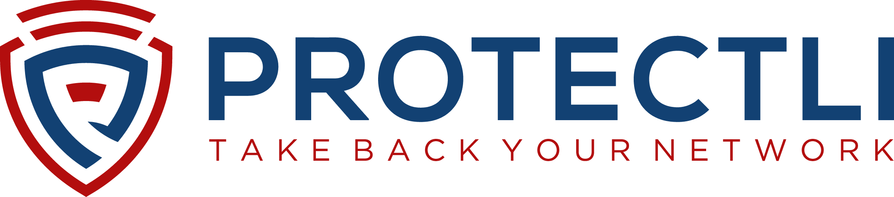
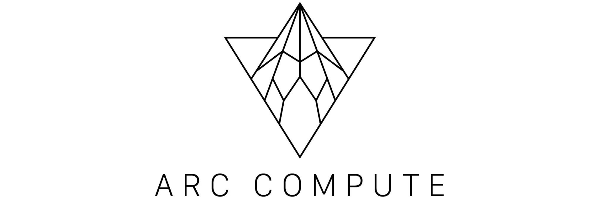
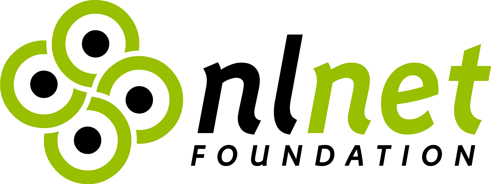

---
hide:
  - navigation
  - toc
---

<link rel="stylesheet" href="https://cdnjs.cloudflare.com/ajax/libs/font-awesome/4.7.0/css/font-awesome.min.css">

  
  

 

---

<h2 align="left" style="margin-top: 0px;">
  <b>CFP Due:</b> 29th August 2022
</h2>
<h2 align="left" style="margin-top: 0px;">
  <b>Notification of Acceptance:</b> 31th August 2022
</h2>
<h2 align="left" style="margin-top: 0px;">
  <b>Conference Date:</b> 9th - 11th September 2022
</h2>

<h2 align="left" style="margin-top: 0px;">
  <b>Calendar Invites:</b>
  <a href="static/qubes-summit-2022.ics">iCal</a> /
  <a href="https://calendar.google.com/event?action=TEMPLATE&tmeid=MXRiN3U0MmplbzdkM2lwamdiYzc4Zm84b2UgZXZlbnRzQDNtZGViLmNvbQ&tmsrc=events%403mdeb.com" target="_blank">Google</a>
</h2>
<h2 align="left" style="margin-top: 0px;">
  <b>Schedule</b>
  <a href="https://cfp.3mdeb.com/qubes-os-summit-2022/schedule/#" target="_blank">Click to see full schedule</a>
</h2>

---

<h1 align="left" style="margin-top: 0px;">
CFP for Qubes OS summit 2022 is now closed.
</h1>

<h3 align="left" style="margin-top: 0px;">
Thank you for all your submissions!

---

<h1 align="left" style="margin-top: 0px;">
Venue
</h1>

<h3 align="left" style="margin-top: 0px;">
The event will take place at <a href="https://co-up.de/about/" target="_blank">co.up Community</a>, accessible at <a href="https://www.openstreetmap.org/?mlat=52.5003&mlon=13.4198#map=16/52.5003/13.4198" target="_blank">Adalbertstraße 5-6, 10999 Berlin</a>.
</h3>
 
---

<h1 align="left" style="margin-top: 0px;">
Accessibility
</h1>

<h3 align="left" style="margin-top: 0px;">
There is an elevator available to reach the venue (it is on the 3rd floor). The bathrooms are not wheelchair accessible, but nearby there are accessible bathrooms at Wilhelm Liebknecht/Namik Kemal Bibliothek, Möbel Olfe, and Südblock. More information at <a href="https://www.wheelmaps.org" target="_blank">Wheelmap.org</a>
</h3>

---

<h1 align="left" style="margin-top: 0px;">
Hygiene and Safety Guidelines
</h1>

<h3 align="left" style="margin-top: 0px;">

The event space is a 2G+ space, please familiarize yourself with the <a
href="https://co-up.de/hygiene-safety-guidelines/" target="_blank">Hygiene and
Safety Guidelines</a>. We will have masks and antigen tests available to event
participants should you want one.</h3>

---

<h1 align="left" style="margin-top: 0px;">
Registration form
</h1>

<h3 align="left" style="margin-top: 0px;">
Please fill the <a
href="https://cloud.3mdeb.com/index.php/apps/forms/Y7Mb7LHLmXWspY4o" target="_blank">online form</a>, if you would like to attend.

The number of participants is limited, so
filling out the form does not guarantee participation. Check your mailbox for a
confirmation email.</h3>

---
<h1 align="left" style="margin-top: 0px;">
Code of Conduct
</h1>

<h3 align="left" style="margin-top: 0px;">
This event is covered by the Qubes OS project
<a href="https://www.qubes-os.org/code-of-conduct/" target="_blank">Code of Conduct</a>. Should you have any questions or concerns, please reach out to the event organizers or via email with the CoC team.
</h3>

---
  
<h1 align="left" style="margin-top: 0px;">
Qubes OS Summit Schedule
</h1>

<h3 align="left" style="margin-top: 0px;">
The full schedule is available at: https://cfp.3mdeb.com/qubes-os-summit-2022/schedule/

 
---
<h1 align="Left" style="margin-top: 0px;">
Social media
</h1>

<h2 align="Left" style="margin-top: 0px;">
  
  <a href="https://twitter.com/QubesOS" target="_blank"> Qubes OS </a>
</h2>
<h2 align="Left" style="margin-top: 0px;">
  
  <a href="https://twitter.com/3mdeb_com" target="_blank"> 3mdeb </a>
</h2>
<h2 align="Left" style="margin-top: 0px;">
  
  <a href="https://www.reddit.com/user/3mdeb/" target="_blank"> 3mdeb </a>
</h2>

---

<h1 align="Left" style="margin-top: 0px;">
Sponsors
</h1>

  

  

    
  

  

    
  

  

    
  

  

    
  

    

    
  

<h3 align="left" style="margin-top: 0px;">
Want to support the Qubes OS summit 2022?
  <a href="https://calendly.com/3mdeb/" target="_blank">Let's talk about it!</a>
</h3>
