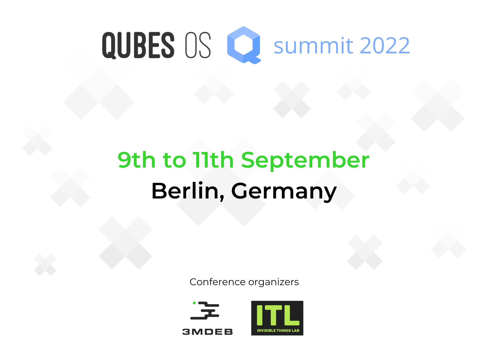

---
hide:
  - navigation
  - toc
---

<link rel="stylesheet" href="https://cdnjs.cloudflare.com/ajax/libs/font-awesome/4.7.0/css/font-awesome.min.css">

  
  

 

---

<h2 align="left" style="margin-top: 0px;">
  <b>CFP Due:</b> 29th August 2022
</h2>
<h2 align="left" style="margin-top: 0px;">
  <b>Notification of Acceptance:</b> 31th August 2022
</h2>
<h2 align="left" style="margin-top: 0px;">
  <b>Conference Date:</b> 9th - 11th September 2022
</h2>

<h2 align="left" style="margin-top: 0px;">
  <b>Calendar Invites:</b>
  <a href="static/qubes-summit-2022.ics">iCal</a> /
  <a href="https://calendar.google.com/event?action=TEMPLATE&tmeid=MXRiN3U0MmplbzdkM2lwamdiYzc4Zm84b2UgZXZlbnRzQDNtZGViLmNvbQ&tmsrc=events%403mdeb.com" target="_blank">Google</a>
</h2>

---

<h1 align="left" style="margin-top: 0px;">
CFP for Qubes OS summit 2022 is open!
</h1>

<h3 align="left" style="margin-top: 0px;">
We are waiting for your submissions and suggestions for the talks.
Please send a brief description (up to 300 characters) to
<a href="mailto:cfp@3mdeb.com?subject=Qubes OS summit 2022, Talk proposal: <Your talk title>">cfp@3mdeb.com</a>
CFP closes on the <b>29th of August 2022</b>. Below is a list of suggested
topics.
</h3>

<h3 align="left" style="margin-top: 0px;">
  <ul>
    <li>UI/UX</li>
    <li>Hardware</li>
    <li>Developers (Qubes internals)</li>
    <li>Security features</li>
    <li>App VMs</li>
    <li>Other Qubes OS related topics</li>
  </ul>
</h3>

---

<h1 align="left" style="margin-top: 0px;">
Venue
</h1>

<h3 align="left" style="margin-top: 0px;">
The event will take place in Berlin. The exact venue will be announced soon.
</h3>

---
<h1 align="left" style="margin-top: 0px;">
Code of Conduct
</h1>

<h3 align="left" style="margin-top: 0px;">
This event is covered by the Qubes OS project
<a href="https://www.qubes-os.org/code-of-conduct/" target="_blank">Code of Conduct</a>.
</h3>

<!--
---

<h1 align="center" style="margin-top: 0px;">CFP</h1>

---

<h3 align="center" style="margin-top: 0px;">Qubes OS Summit schedule</h3>

| Time [UTC]  | Description                          |
| ----------- | ------------------------------------ |
| **15:30 - 15:50** | |
| **15:50 - 16:00** | |
| **16:00 - 16:10** | |
| **16:10 - 16:30** | |
| **16:30 - 17:00** | |
| **17:00 - 17:10** | |
| **17:10 - 17:30** | |
| **17:30 - 18:00** | |
| **18:00 - 18:10** | |
| **18:10 - 18:30** | |
| **18:30 - last <i>haker</i> standing** | |

-->
---
<h1 align="Left" style="margin-top: 0px;">
Social media
</h1>

<h2 align="Left" style="margin-top: 0px;">
  
  <a href="https://twitter.com/QubesOS" target="_blank"> Qubes OS </a>
</h2>
<h2 align="Left" style="margin-top: 0px;">
  
  <a href="https://twitter.com/3mdeb_com" target="_blank"> 3mdeb </a>
</h2>
<h2 align="Left" style="margin-top: 0px;">
  
  <a href="https://www.reddit.com/user/3mdeb/" target="_blank"> 3mdeb </a>
</h2>

---

<h1 align="Left" style="margin-top: 0px;">
Sponsors
</h1>

<h3 align="left" style="margin-top: 0px;">
Want to support the Qubes OS summit 2022?
  <a href="https://calendly.com/3mdeb/" target="_blank">Let's talk about it!</a>
</h3>
